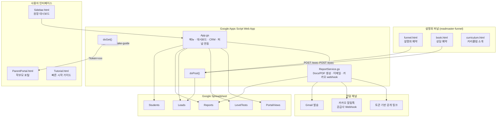

<div align="center">

# READ MASTER Parent Portal

**프랜차이즈 학원의 학부모 리포트 생성부터 설명회 리드 관리까지,<br>Google Sheets 하나로 운영하는 올인원 학원 운영 허브**

[](https://developers.google.com/apps-script)
[](https://github.com/google/clasp)
[](https://sheets.google.com)
[](/)
[](/)

<br>


</div>

---

## :books: Philosophy &mdash; 철학

> **"학원 운영의 핵심은 학부모와의 신뢰 소통이다."**

학원 원장과 강사가 가장 많은 시간을 쓰는 업무는 학부모 리포트 작성, 설명회 후속 연락, 상담 일정 관리입니다. 이 프로젝트는 그 반복 업무를 Google Sheets 안에서 끝내도록 설계했습니다. 별도 SaaS 가입 없이, 이미 쓰고 있는 스프레드시트에서 리포트 생성, 학부모 링크 발급, 리드 CRM, 후속 연락 큐까지 한 번에 운영합니다.

| | **기존 방식** | **READ MASTER Parent Portal** |
|---|---|---|
| **리포트 작성** | Word/한글 수작업, 학생별 복사-붙여넣기 | Students 시트 입력 후 일괄 자동 생성 (Docs + PDF) |
| **학부모 전달** | 카톡 수동 전송, PDF 개별 첨부 | 토큰 기반 공개 링크 자동 발급, 이메일/카카오 webhook 선택 |
| **설명회 리드 관리** | 종이 명단, 엑셀 별도 파일 | 퍼널 폼 제출 즉시 Leads 시트 자동 적재 |
| **후속 상담 추적** | 원장 머릿속 기억 | 자동 후속조치 큐, 담당자별 할 일 보드, 콜 리스트 |
| **레벨테스트 결과** | 별도 문서 작성 | LevelTests 시트 입력 후 리포트 자동 생성 |
| **멀티 캠퍼스** | 지점별 완전 별도 운영 | 캠퍼스명 기반 분기, 본사 템플릿 공유 |

---

## :building_construction: Architecture &mdash; 아키텍처



---

## :sparkles: Layer Features &mdash; 기능 계층

### :page_facing_up: Layer 1 &mdash; 학부모 리포트 엔진

| 기능 | 설명 |
|---|---|
| **Google Docs 자동 생성** | 학생명, 보호자명, 반, 강점, 보완점, 다음 학습 제안 등 14개 필드를 템플릿에 자동 치환 |
| **PDF 자동 변환** | 생성된 Docs를 PDF로 즉시 변환, Drive 폴더에 자동 저장 |
| **본사 템플릿 지원** | `templateDocId` 설정으로 본사 표준 문서 서식을 가맹점에 배포 |
| **일괄 생성** | Students 시트의 Generate 열 체크 후 전체 학생 리포트 한 번에 생성 |
| **레벨테스트 리포트** | LevelTests 시트에서 점수 입력 후 레벨테스트 전용 리포트 자동 생성 |

> **Wow Moment** : 원장이 Students 시트에 학생 데이터를 넣고 "일괄 생성" 한 번 누르면, 학생별 Google Docs + PDF + 학부모 확인 링크가 동시에 만들어지고, Reports 시트에 전달 상태까지 자동 기록됩니다.

### :link: Layer 2 &mdash; 학부모 포털 & 전달

| 기능 | 설명 |
|---|---|
| **토큰 기반 공개 포털** | 학부모가 로그인 없이 고유 링크로 리포트 확인 (모바일 최적화) |
| **열람 로그 추적** | 학부모가 링크를 열면 PortalViews 시트에 자동 기록 |
| **이메일 발송** | Gmail API로 PDF 첨부 + 포털 링크 동시 전달 |
| **카카오 알림톡 webhook** | 알림톡 공급사 API에 구조화된 payload 전송 (리포트 확인 + 상담 예약 버튼 포함) |
| **상담 예약 / 커리큘럼 연결** | 리포트 하단에 상담 예약 URL, 커리큘럼 소개 URL 버튼 자동 삽입 |

> **Wow Moment** : 학부모가 카카오톡으로 받은 링크를 터치하면, 로그인 없이 자녀의 종합 점수, 강점, 보완점을 바로 확인하고, "상담 예약" 버튼으로 이어집니다. 원장은 누가 리포트를 열었는지 실시간으로 확인합니다.

### :chart_with_upwards_trend: Layer 3 &mdash; 설명회 리드 CRM

| 기능 | 설명 |
|---|---|
| **퍼널 리드 자동 적재** | 설명회/상담 예약 폼 POST 즉시 Leads 시트에 누적 |
| **리드 상태 파이프라인** | `NEW` → `CONTACTED` → `TEST_BOOKED` → `REPORT_READY` → `ENROLLED` 5단계 관리 |
| **상태별 색상 규칙** | 리드 상태에 따라 시트 행 자동 색상 적용 |
| **자동 후속조치 큐** | 연락 후 2일 초과, 테스트 미예약, 리포트 미열람 학부모를 자동 추출 |
| **오늘의 콜 리스트** | 후속조치 큐에서 전화 우선순위 자동 정렬, 후속 메시지 초안 자동 생성 |
| **담당자별 할 일 보드** | 원장/실장/강사별 오늘 처리할 리드 자동 분류 |
| **리드 → 학생 전환** | Leads에서 Students 시트로 원클릭 전환, 레벨테스트 → 리포트 흐름 연결 |

> **Wow Moment** : 설명회 신청 폼을 제출하면 3초 안에 Leads 시트에 적재되고, 대시보드 "최근 리드"에 즉시 반영됩니다. 원장은 사이드바에서 상태 변경, 메모 추가, 학생 전환까지 시트를 직접 스크롤하지 않고 처리합니다.

### :gear: Layer 4 &mdash; 운영 대시보드

| 기능 | 설명 |
|---|---|
| **5탭 사이드바 대시보드** | 개요, 설정, 리포트, CRM, 연동 가이드를 탭으로 전환 |
| **실시간 통계** | 학생 수, 리포트 수, 리드 수, 레벨테스트 수, 포털 조회 수, 후속조치 큐 한눈에 확인 |
| **가맹점 설정 저장** | 브랜드명, 캠퍼스명, 전달 방식, 카카오 webhook, 퍼널 URL 등 17개 항목 UI에서 관리 |
| **빠른 시작 튜토리얼** | 14단계 가이드 모달로 신규 가맹점 온보딩 지원 |
| **스프레드시트 메뉴** | 14개 운영 액션을 메뉴에서 바로 실행 |

---

## :rocket: Getting Started &mdash; 시작 가이드

### Starter &mdash; 단일 캠퍼스 빠른 시작

학원 1개 캠퍼스에서 학부모 리포트를 바로 시작하는 최소 구성입니다.

```bash
# 1. 저장소 클론 및 의존성 설치
git clone https://github.com/Reasonofmoon/readmaster-parent-portal.git
cd readmaster-parent-portal
npm install

# 2. clasp 로그인 및 Apps Script 프로젝트 생성
npm run clasp:login
npm run clasp:create

# 3. 코드 푸시
npm run clasp:push

# 4. Apps Script 편집기 열기
npm run clasp:open
```

그 다음 Apps Script 편집기에서:
1. `배포 > 새 배포 > 웹 앱` 선택
2. 실행 계정: `나` / 접근 권한: `모든 사용자`
3. 스프레드시트에서 `READ MASTER 리포트 > 워크스페이스 초기화` 실행
4. `대시보드 열기` → 가맹점 설정 저장

### Professional &mdash; 퍼널 연동 + 카카오 전달

설명회 퍼널과 카카오 알림톡까지 연결하는 구성입니다.

```bash
# Starter 단계 완료 후

# 5. 웹앱 URL 확인
# GET ?mode=intake-guide 로 현재 연결 상태 확인

# 6. readmaster-funnel 연동
# readmaster-funnel/assets/readmaster-config.js에 웹앱 URL 반영

# 7. 카카오 알림톡 공급사 webhook 설정
# 대시보드 > 카카오 webhook URL, Token, 템플릿 코드, 발신 프로필 Key 입력
```

추가 설정:
- `전달 방식`을 `email_and_link` 또는 `kakao_webhook`으로 변경
- `설명회 퍼널 URL`, `상담 예약 URL`, `커리큘럼 소개 URL` 입력
- 운영 검증: 퍼널 폼 제출 1건 → Leads 시트 적재 확인

### Enterprise &mdash; 멀티 캠퍼스 프랜차이즈

본사-가맹점 구조에서 표준 템플릿으로 운영하는 구성입니다.

1. **본사**: 표준 Google Docs 템플릿 작성 후 `templateDocId`로 공유
2. **가맹점별**: 동일 Apps Script를 복제하거나 시트 공유 + 캠퍼스명 분기
3. **브랜드 통제**: `brandName`, `schoolName` 본사 기준 고정
4. **캠퍼스별 리드 분리**: `캠퍼스별 리드 보기` 메뉴로 지점별 필터
5. **운영 점검**: [OPERATIONS-CHECKLIST.md](docs/OPERATIONS-CHECKLIST.md) 기준으로 매일/매주 반복

---

## :wrench: Customization &mdash; 설정 항목

| 설정 항목 | 기본값 | 설명 |
|---|---|---|
| `brandName` | `READ MASTER` | 리포트와 이메일에 표시되는 브랜드명 |
| `campusName` | `본원` | 캠퍼스(지점)명 |
| `schoolName` | `READ MASTER` | 학원 정식 명칭 |
| `senderName` | `READ MASTER 리포트봇` | 이메일 발신자명 |
| `templateDocId` | (빈 값) | 본사 표준 Google Docs 템플릿 ID |
| `reportFolderName` | `READ MASTER Parent Reports` | 리포트 저장 Drive 폴더명 |
| `parentPortalBaseUrl` | (웹앱 URL 자동) | 학부모 포털 기본 URL |
| `enableParentPortal` | `true` | 학부모 공개 링크 사용 여부 |
| `enableEmailDelivery` | `false` | 이메일 자동 발송 활성화 |
| `deliveryMode` | `link_only` | 전달 방식 (`link_only`, `email`, `email_and_link`, `kakao_webhook`) |
| `kakaoWebhookUrl` | (빈 값) | 카카오 알림톡 공급사 webhook URL |
| `kakaoWebhookToken` | (빈 값) | webhook 인증 Bearer 토큰 |
| `kakaoTemplateCode` | (빈 값) | 카카오 알림톡 템플릿 코드 |
| `kakaoSenderKey` | (빈 값) | 카카오 발신 프로필 Key |
| `funnelEntryUrl` | `https://readmaster-funnel.vercel.app/funnel` | 설명회 퍼널 URL |
| `bookingPageUrl` | `https://readmaster-funnel.vercel.app/book` | 상담 예약 URL |
| `curriculumPageUrl` | `https://readmaster-funnel.vercel.app/curriculum` | 커리큘럼 소개 URL |

---

## :file_folder: Project Structure &mdash; 프로젝트 구조

```
readmaster-parent-portal/
├── src/
│   ├── App.gs                  # 웹앱 진입점, 시트 메뉴, 리드 CRM, 대시보드 데이터
│   ├── ReportService.gs        # Docs/PDF 생성, 이메일 발송, 카카오 webhook
│   ├── Sidebar.html            # 원장용 5탭 대시보드 (개요/설정/리포트/CRM/연동)
│   ├── ParentPortal.html       # 학부모 공개 리포트 확인 페이지
│   ├── Tutorial.html           # 14단계 빠른 시작 가이드 모달
│   └── appsscript.json         # Apps Script 매니페스트 (V8, 6개 OAuth 스코프)
├── docs/
│   ├── DEPLOYMENT.md           # 웹앱 배포 및 퍼널 URL 연결 가이드
│   ├── FUNNEL-INTEGRATION.md   # readmaster-funnel 연동 기준 문서
│   ├── CHANNELS.md             # 링크/이메일/카카오 전달 채널 구조
│   ├── OPERATIONS-CHECKLIST.md # 배포 후 점검 및 일상 운영 체크리스트
│   ├── ACADEMY-TOOLS.md        # 제품 로드맵 (P0/P1/P2)
│   └── IDEAS.md                # 확장 도구 아이디어
├── .clasp.json.example         # clasp 설정 예시 (실제 .clasp.json은 Git 제외)
├── .claspignore                # clasp push 제외 파일
├── .gitignore                  # .clasp.json, node_modules 제외
├── package.json                # clasp 3.0 devDependency
└── SECURITY.md                 # 보안 정책 및 제보 안내
```

---

## :bar_chart: Numbers &mdash; 프로젝트 수치

| 항목 | 수치 |
|---|---|
| **Google Sheets 자동 생성** | 5개 (Students, Reports, Leads, LevelTests, PortalViews) |
| **스프레드시트 메뉴 액션** | 14개 |
| **리포트 템플릿 치환 필드** | 14개 (`{{student_name}}`, `{{overall_score}}` 등) |
| **리드 상태 파이프라인** | 5단계 (NEW → CONTACTED → TEST_BOOKED → REPORT_READY → ENROLLED) |
| **전달 채널** | 4종 (공개 링크, 이메일, 이메일+링크, 카카오 webhook) |
| **대시보드 탭** | 5개 (개요, 설정, 리포트, CRM, 연동) |
| **가맹점 설정 항목** | 17개 |
| **웹앱 엔드포인트** | 3개 (GET token, POST intake, GET intake-guide) |
| **OAuth 스코프** | 6개 (Sheets, Docs, Drive, Gmail, External Request, Container UI) |
| **튜토리얼 단계** | 14단계 |
| **소스 파일** | 6개 (GS 2개 + HTML 3개 + manifest 1개) |

---

## :clipboard: Requirements &mdash; 요구사항

| 요구사항 | 버전/조건 |
|---|---|
| **Node.js** | 16+ (clasp 실행용) |
| **@google/clasp** | ^3.0.6 |
| **Google 계정** | Apps Script 접근 권한 필요 |
| **Google Spreadsheet** | 웹앱과 연결할 시트 1개 |
| **Apps Script 런타임** | V8 |
| **타임존** | `Asia/Seoul` (기본값) |

### 선택 요구사항

| 요구사항 | 용도 |
|---|---|
| **Gmail 발송 권한** | 이메일 전달 모드 사용 시 |
| **카카오 알림톡 공급사 계정** | 카카오 자동 발송 시 (별도 계약 필요) |
| **readmaster-funnel 배포** | 설명회 퍼널 / 상담 예약 페이지 연동 시 |
| **Google Docs 템플릿** | 본사 표준 리포트 서식 사용 시 |

---

## :globe_with_meridians: i18n &mdash; 다국어

| 영역 | 언어 |
|---|---|
| **학부모 리포트 본문** | 한국어 (Korean) |
| **학부모 포털 UI** | 한국어 (Korean) |
| **대시보드 / 튜토리얼** | 한국어 (Korean) |
| **카카오 알림톡 메시지** | 한국어 (Korean) |
| **이메일 발송 본문** | 한국어 (Korean) |
| **코드 주석 / 변수명** | 영어 (English) |
| **시트 헤더** | 영어 (English) |

현재 한국 학원 프랜차이즈 운영에 최적화되어 있습니다. 리포트 본문, 전달 메시지, 대시보드 UI는 모두 한국어로 제공됩니다.

---

## :handshake: Contributing &mdash; 기여 가이드

1. 이 저장소를 Fork 합니다
2. Feature 브랜치를 생성합니다 (`git checkout -b feature/amazing-feature`)
3. 변경 사항을 커밋합니다 (`git commit -m 'Add amazing feature'`)
4. 브랜치에 푸시합니다 (`git push origin feature/amazing-feature`)
5. Pull Request를 생성합니다

### 기여 시 주의사항

- `.clasp.json`, webhook token, API 키, 운영 Google 계정 정보는 절대 커밋하지 마세요
- Apps Script 코드 변경 시 `clasp push`로 동작 확인 후 PR을 올려주세요
- 퍼널 URL이나 intake 구조를 바꾼 경우 `docs/` 문서도 함께 갱신해 주세요
- 보안 이슈는 GitHub issue 대신 [SECURITY.md](SECURITY.md) 절차를 따라주세요

---

## :page_with_curl: License

현재 이 저장소에는 별도 라이선스 파일이 없습니다. 외부 공개 배포 기준을 정하기 전까지는 사용 조건이 명시적으로 확정되지 않은 상태입니다.

---

<div align="center">

**READ MASTER Parent Portal**

학부모 리포트 자동화 &bull; 설명회 리드 CRM &bull; 카카오/이메일 전달 &bull; 학부모 포털

Google Sheets + Apps Script로 학원 운영의 반복 업무를 자동화합니다.

<sub>Built with Google Apps Script &bull; Powered by Google Sheets &bull; Delivered via Email, KakaoTalk & Web Portal</sub>

</div>
